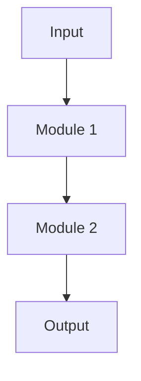

# {{title}}

## Research Question

> Describe the core problem in one sentence:

## Motivation & Background

- Why is this problem important?
- What are the limitations of existing approaches?

## Core Innovation

1.

## Related Work

| Paper | Core Method | Relationship to This Idea |
|-------|-------------|--------------------------|
|       |             |                           |

## Preliminary Approach

### Method Overview

### Technical Roadmap

## Expected Experiments

- **Datasets**:
- **Baselines**:
- **Metrics**:
- **Expected Results**:

## Feasibility Analysis

| Dimension | Assessment | Notes |
|-----------|------------|-------|
| Data Availability | ⬜ | |
| Compute Resources | ⬜ | |
| Technical Difficulty | ⬜ | |
| Novelty | ⬜ | |

> [!warning] Risks & Mitigations
>
> | Risk | Probability | Mitigation |
> |------|-------------|------------|
> |      |             |            |

## Target Venue

-

> [!tip] Next Steps
> - [ ]

## References

-
