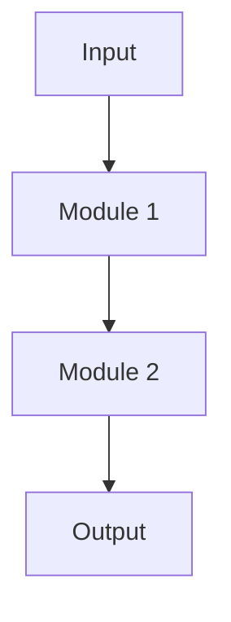

# {{title}}

## Research Question

> 一句话描述核心问题：

## Motivation & Background

- 为什么这个问题重要？（2-3 条）
- 现有方法的局限？（2-3 条）

## Core Innovation

1. 创新点

## Related Work

| 论文 | 核心方法 | 与本 Idea 的关系 |
|------|----------|-----------------|
|      |          |                  |

> 详细竞争分析见子文档。

## Preliminary Approach

### Method Overview

简要描述方法（5-10 行）。详见子文档。

### Technical Roadmap

## Status & Next Steps

- 当前状态摘要
- [ ] 下一步行动

## Target Venue

-

## Deep Dives

> 随研究深入按需创建的深度文档。

| 文档 | 主题 | 更新日期 |
|------|------|----------|
|      |      |          |

## References

-
