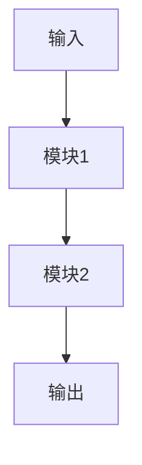

# {{title}}

## 研究问题

> 用一句话描述你想解决的核心问题：

## 动机与背景

- 为什么这个问题重要？
- 现有方法的局限是什么？

## 核心创新点

1.

## 相关工作

| 论文 | 核心方法 | 与本idea的关系 |
|------|----------|---------------|
|      |          |               |

## 初步方案

### 方法概述

### 技术路线

## 预期实验

- **数据集**：
- **基线方法**：
- **评价指标**：
- **预期结果**：

## 可行性分析

| 维度 | 评估 | 备注 |
|------|------|------|
| 数据可获得性 | ⬜ | |
| 计算资源 | ⬜ | |
| 技术难度 | ⬜ | |
| 新颖性 | ⬜ | |

> [!warning] 风险与应对
>
> | 风险 | 概率 | 应对策略 |
> |------|------|----------|
> |      |      |          |

## 目标期刊/会议

-

> [!tip] 下一步行动
> - [ ]

## 参考文献

-
